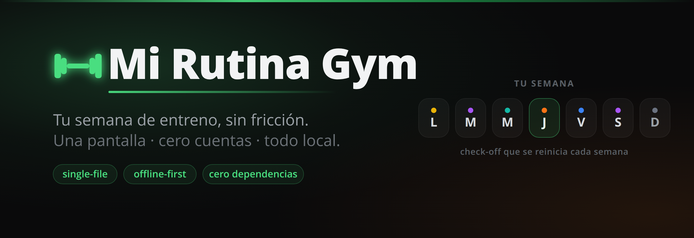
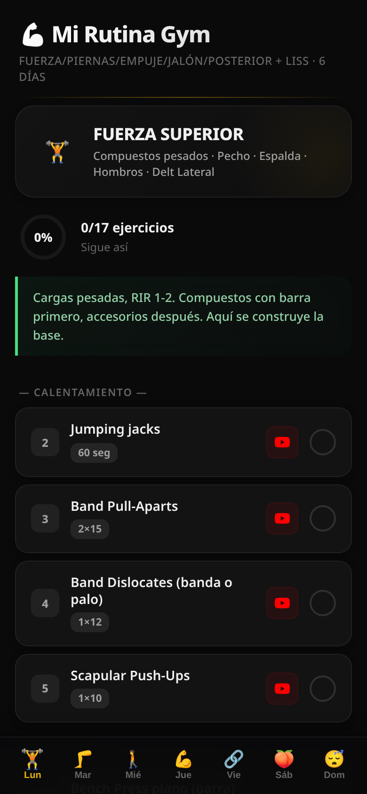
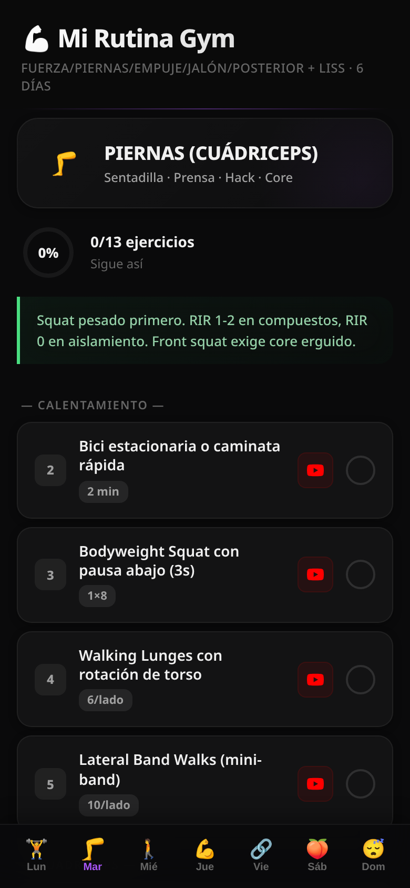
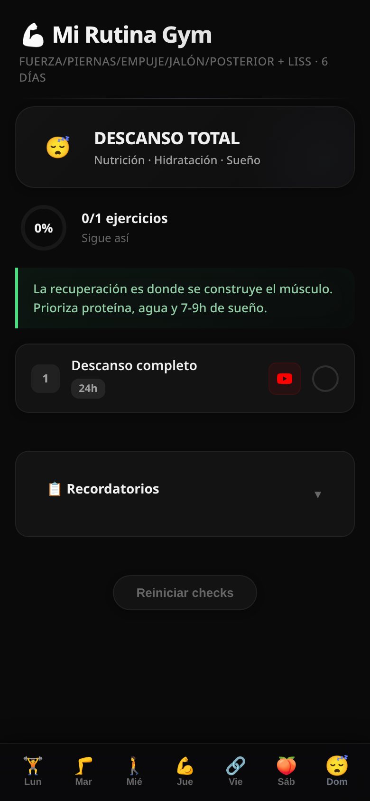

<a id="top"></a>

<p align="center">
  
</p>

<p align="center">
  
  
  
  
  
  
</p>

<p align="center">
  <b><a href="#-español">🇪🇸 Español</a> &nbsp;·&nbsp; <a href="#-english">🇬🇧 English</a></b>
</p>

---

<a id="-español"></a>

## 🇪🇸 Español

> **Tu semana de entreno, sin fricción.** Una sola pantalla, cero cuentas, todo local.

**Mi Rutina Gym** (codename del repo: `panoptes`) es un tracker de rutina de gimnasio en **un único archivo HTML**. Abres la app, eliges el día, y vas marcando los ejercicios que completas. El progreso se guarda en el navegador y se reinicia solo cada semana. Sin login, sin backend, sin instalar nada.

<p align="center">
  
  &nbsp;&nbsp;
  
  &nbsp;&nbsp;
  
</p>

### ✨ Características

- **Semana completa Lun → Dom** con foco por día (fuerza, piernas, empuje, jalón, posterior y LISS).
- **Categorías codificadas por color** para identificar el tipo de sesión de un vistazo.
- **Check-off por ejercicio** con anillo de progreso (`0/17 ejercicios`, porcentaje en vivo).
- **Reinicio semanal automático** — cada semana arranca limpia; botón para reiniciar a mano.
- **Notas de técnica y recordatorios** plegables en cada día.
- **Series, repeticiones y descanso** visibles por ejercicio, con enlace de demostración.
- **Mobile-first / PWA-ish** — pensada para usarse desde el móvil en el gym, instalable a pantalla completa.
- **100% local y privado** — los datos viven en `localStorage`; nada sale del navegador.

### ⚙️ Cómo funciona

El estado se persiste en `localStorage` bajo la clave `gym_checks`, etiquetado con un identificador de semana (`weekId`). Al cambiar de semana, los checks se descartan automáticamente y la rutina vuelve a cero — sin tocar nada.

| Día | Foco | Color |
|-----|------|:-----:|
| Lun | Fuerza superior | 🟡 |
| Mar | Piernas · cuádriceps | 🟣 |
| Mié | Cardio · LISS | 🟢 |
| Jue | Empuje / superior | 🟠 |
| Vie | Jalón · espalda | 🔵 |
| Sáb | Posterior · glúteo | 🟣 |
| Dom | Descanso total | ⚪ |

### 🧱 Stack

- **HTML + CSS + JavaScript vanilla**, sin frameworks ni dependencias.
- Sin paso de build: el archivo se sirve tal cual.
- Estilo dark con glassmorphism, acento verde y tipografía del sistema.
- Persistencia con `localStorage` (sin servidor).

### 🚀 Uso y despliegue

**En local** — clona y abre el archivo, o sírvelo con cualquier servidor estático:

```bash
git clone https://github.com/PieroJF/panoptes.git
cd panoptes
python3 -m http.server 8787
# abre http://127.0.0.1:8787/index.html
```

**En producción** — al ser un único HTML estático, funciona en cualquier hosting de estáticos. Este proyecto se despliega en **Cloudflare Workers**, pero Cloudflare Pages, GitHub Pages, Netlify o Vercel sirven igual sin configuración.

### 📁 Estructura

```text
panoptes/
├── index.html          # toda la app (HTML + CSS + JS en un archivo)
├── assets/             # banner, social preview y capturas
│   ├── banner.svg / .png
│   ├── social-preview.png
│   └── screenshots/
├── docs/               # spec de diseño del repo
└── LICENSE
```

### 🔒 Privacidad

No hay cuentas, ni backend, ni analítica. Toda la información de tu rutina y tu progreso se queda en tu navegador (`localStorage`). Borrar los datos del sitio borra todo.

<p align="right"><a href="#top">↑ Volver arriba</a></p>

---

<a id="-english"></a>

## 🇬🇧 English

> **Your training week, zero friction.** One screen, no accounts, all local.

**Mi Rutina Gym** (repo codename: `panoptes`) is a gym routine tracker built as **a single HTML file**. Open the app, pick the day, and tick off exercises as you complete them. Progress is saved in the browser and resets itself every week. No login, no backend, nothing to install.

<p align="center">
  
  &nbsp;&nbsp;
  
  &nbsp;&nbsp;
  
</p>

### ✨ Features

- **Full week Mon → Sun** with a focus per day (strength, legs, push, pull, posterior chain, LISS).
- **Color-coded categories** to recognize the session type at a glance.
- **Per-exercise check-off** with a progress ring (`0/17 exercises`, live percentage).
- **Automatic weekly reset** — every week starts clean; manual reset button included.
- **Collapsible technique notes and reminders** on each day.
- **Sets, reps and rest** visible per exercise, with a demo link.
- **Mobile-first / PWA-ish** — made to use from your phone at the gym, installable fullscreen.
- **100% local and private** — data lives in `localStorage`; nothing leaves the browser.

### ⚙️ How it works

State is persisted in `localStorage` under the `gym_checks` key, tagged with a week identifier (`weekId`). When the week changes, checks are discarded automatically and the routine resets to zero — no action needed.

| Day | Focus | Color |
|-----|-------|:-----:|
| Mon | Upper-body strength | 🟡 |
| Tue | Legs · quads | 🟣 |
| Wed | Cardio · LISS | 🟢 |
| Thu | Push / upper | 🟠 |
| Fri | Pull · back | 🔵 |
| Sat | Posterior · glutes | 🟣 |
| Sun | Full rest | ⚪ |

### 🧱 Stack

- **Vanilla HTML + CSS + JavaScript**, no frameworks or dependencies.
- No build step: the file is served as-is.
- Dark glassmorphism UI, green accent, system typography.
- `localStorage` persistence (serverless).

### 🚀 Usage & deployment

**Local** — clone and open the file, or serve it with any static server:

```bash
git clone https://github.com/PieroJF/panoptes.git
cd panoptes
python3 -m http.server 8787
# open http://127.0.0.1:8787/index.html
```

**Production** — being a single static HTML file, it runs on any static host. This project deploys to **Cloudflare Workers**, but Cloudflare Pages, GitHub Pages, Netlify or Vercel all work with zero config.

### 📁 Structure

```text
panoptes/
├── index.html          # the whole app (HTML + CSS + JS in one file)
├── assets/             # banner, social preview and screenshots
│   ├── banner.svg / .png
│   ├── social-preview.png
│   └── screenshots/
├── docs/               # repo design spec
└── LICENSE
```

### 🔒 Privacy

No accounts, no backend, no analytics. All your routine and progress data stays in your browser (`localStorage`). Clearing the site data clears everything.

<p align="right"><a href="#top">↑ Back to top</a></p>

---

## 📄 Licencia / License

[MIT](LICENSE) © 2026 Piero JF
